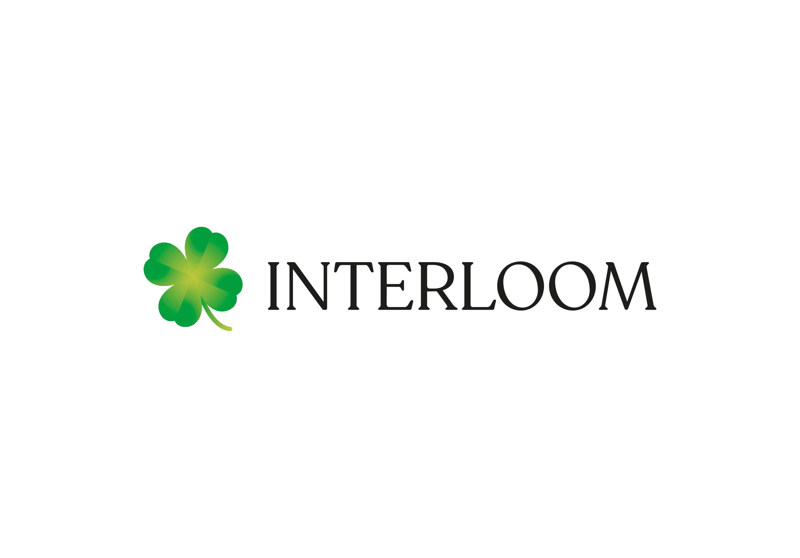

# Mockup Critique — Interloom Hi-Fi Prototype
> Captured: May 21, 2026
> Stage: Close-to-final · Scope: full pass on all 11 pages
> Inputs: `docs/*.html` rendered to PDFs + read HTML/CSS source
> Reference: `BRAND_SUMMARY.md` (Manual de Marca 2026), `04_current-site/DESIGN_CRITIQUE.md`

---

## TL;DR

The mockup is materially on-brand and a major step forward from the current site. The design system (tokens, typography, spacing, components) is implemented correctly across all pages — same CSS variables, same Playfair + Lexend stack, same forest-green accents, same surface-warm sections. Nav structure, footer, contact patterns, and the division catalog template are all directionally right.

Three items that appear to diverge from the prior `04_current-site/DESIGN_CRITIQUE.md` (the dark-photo hero, the Del Campo blue treatment, and the WhatsApp CTA pattern) are **client-directed decisions and locked** — they are not open for redesign. Section "Client-directed choices" below covers execution-level notes inside those decisions, not whether they should exist.

The remaining ~dozen items are polish and bug fixes — the most urgent of which is a logo sizing bug that will break the header on every page.

---

## What's working (and worth protecting)

### Brand system implementation

The CSS tokens map exactly to the Manual de Marca:

```css
--text-primary:    #1D1D1B;   /* near-black, brand-correct */
--text-secondary:  #4A3625;   /* dark brown, brand-correct */
--accent-warm:     #9F8A73;   /* warm tan, brand-correct */
--accent-green:    #2E7B37;   /* forest green for UI, brand-correct */
--surface-warm:    #FAF8F5;   /* off-white for alternating sections */
--hairline:        #EDEAE3;
```

This is *exactly* what the previous critique called for. Forest green is used for CTAs and links (not the bright clover-gradient `#009E3C`), near-black is the body color, surface-warm carries the alternating sections — the brand discipline is real, and it's everywhere.

### Typography is on-spec across pages

Playfair Display Regular for headings, italic Playfair for accents and pull-quotes, Lexend Light (300/400) for body and UI, eyebrow style = Lexend 12px uppercase in `--accent-warm`. The three-tier hierarchy (eyebrow → Playfair title → Lexend body) is consistent on every page. No all-caps display headings, sentence case throughout — the single biggest "2022 Bridge theme" tell from the old site is gone.

### Header, footer, and nav

- Sticky white header with hairline bottom border ✓
- Thin off-white utility bar (32px, `--surface-warm`) replacing the old black bar ✓
- New 7-item nav with the correct architecture: Inicio · Nosotros · Del Campo · Divisiones ▾ · Sostenibilidad · Clientes · Contacto ✓
- Divisiones dropdown contains the four export divisions including Greenclover Naturals LLC ✓
- ES | EN text toggle (no flag) ✓
- 5-column footer on `--surface-warm` with brand block, Divisiones, Empresa, Contacto, Certificaciones, plus a legal strip ✓
- Footer includes Greenclover, certifications, social row with LinkedIn added on division pages

### Contact page

The Contacto page is the single biggest visible improvement over the current site. Every issue from the prior critique is addressed:

- Eyebrow + Playfair "Hablemos." headline replaces the dark "CONTACTO" overlay banner
- Segmented paths — Comercial, Exportación, Prensa y comunicación, Trabaja con nosotros — each with its own email link in forest green
- Form has visible labels (NOMBRE, EMPRESA, CORREO ELECTRÓNICO, TELÉFONO, MENSAJE) — not placeholder-only
- "Enviar mensaje" CTA in Spanish and forest green (replaces dark gray "Send")
- Sidebar contact popup is gone

### Nosotros editorial structure

- "Tres décadas de agro peruano" with eyebrow + supporting paragraph + photo (replaces the dark hero banner)
- Stats card on surface-warm with four Playfair numbers
- Sostenibilidad pull-quote with italic Playfair ("…del productor al cliente internacional")
- Mercados block with map and country list
- Team section with real photos for Aranzazu Muelle and Juan José Zevallos (was missing on the old site)

### Division pages — catalog pattern is right

The LDC-style sidebar + product list is the correct pattern, and the implementation is good:

- Sidebar with "Productos" jump-link list, active state, and division-specific certifications block
- Product rows with image (left) + name (Playfair) + description (Lexend) + meta line (origen · presentación · certificación) in `--accent-warm`
- Per-row hover state, "¿Necesitas una cotización personalizada?" closing CTA
- Dark photo closing band with italic Playfair quote — used sparingly and to end the page, not as a hero, which is the correct use

### Sostenibilidad page

Strong structure: certification cards with name + description + "Aplica a: [divisions]" — this is the kind of content density the old site never had. Each certification is properly contextualized.

---

## Client-directed choices (locked)

The three items below diverge from `04_current-site/DESIGN_CRITIQUE.md`, but the divergence is by client request. These are not open to redesign. The notes here are execution-level — how to implement the chosen direction cleanly, not whether to implement it.

### 1. Full-bleed dark-photo hero with white overlay (locked)

The home and division pages use a 78vh / 50vh hero with `hero.jpg` as a full-bleed background, a left-to-right dark gradient mask, and white Playfair + Lexend text overlaid bottom-left.

**Execution notes inside this direction:**

- The hero photo carries most of the brand voice in this approach. The asset has to clear an editorial bar — soft natural light, agricultural subject, contextual depth — not a stock food close-up. Worth reviewing `hero.jpg` and each division hero photo at full resolution against that bar before launch.
- The gradient mask currently uses pure `rgba(0,0,0,0.62)`. Switch to `rgba(29,29,27,0.62)` — same darkening effect, warmer tone, matches the brand near-black. Apply across `.hero .hero-mask`, `.div-hero .hero-mask`, and `.closing-band .closing-mask`.
- The sticky header above the hero stays on white, which keeps the logo off the dark surface — that's the right pattern, don't change it.
- Below the hero, every other section stays on white or `--surface-warm`. That discipline is already in place — protect it as the site grows.

### 2. Del Campo page in Del Campo blue (locked)

The `del-campo.html` page is themed in Del Campo's packaging blue (`#003399`) across eyebrow, stats, "CATÁLOGO" label, and badge. The Del Campo brand panel is the hero asset.

**Execution notes inside this direction:**

- Tokenize the blue. Right now `#003399` is a hardcoded value in `.dc-featured .dc-content .eyebrow` and elsewhere. Lift it to `:root` as `--delcampo-blue: #003399` so it's an explicit, scoped exception rather than a magic number — easier to maintain, easier to audit, easier for the next person to understand.
- Keep the Interloom chrome (header, footer, nav, utility bar, certifications strip) on the Interloom palette. The body of the page goes Del Campo blue, the chrome stays Interloom — that's the truthful "Interloom presenting Del Campo" framing.
- The italic tagline "Lo natural a tu mesa" is already in `--accent-warm` (tan), not blue — that subtle touch keeps a thread of the Interloom palette inside the Del Campo block. Good, keep it.

### 3. WhatsApp green CTA on Del Campo (locked)

The Del Campo card on home and the Del Campo page both use `.btn-whatsapp { background: #25D366 }` as a primary CTA, because the consumer audience actually orders by WhatsApp.

**Execution notes inside this direction:**

- Tokenize the green (`--whatsapp-green: #25D366`) so it's a deliberate, named exception. Same reasoning as the Del Campo blue.
- The class is already `.btn-whatsapp`, not `.btn-primary` — keep that discipline. The WhatsApp green should never appear as a generic primary button. Contacto, division CTAs, and "Solicitar cotización" all use `--accent-green` (forest). That separation needs to hold.
- On the home Del Campo card the WhatsApp CTA is paired with a ghost outlined "Conocer la marca" — that pairing softens the saturation by giving the eye a quieter alternative. Worth keeping as the canonical Del Campo CTA pair.

---

## Issues to fix before launch

### Critical — will break the page

**B1. Logo sizing bug (every page)**

Every page has this in the header:
```html
<a class="brand-logo" href="home-version-a.html">
  
</a>
```

The CSS says `.brand-logo img { height: 40px }`. The inline `style="height:200px"` overrides it. Result: on production the logo will render at 200px tall and blow up the sticky header (which is `height: 80px`). The footer has the same problem: container is 56px tall, image is forced to 200px.

**Fix:** remove the inline `style="height:200px;width:auto;"` from every `` reference in every page. The CSS already sizes it correctly.

### High priority — visible polish

**B2. Placeholders still in the file**

Several pages contain placeholder content that is fine for a mockup but cannot ship:

| Where | Placeholder | Replace with |
|---|---|---|
| `sostenibilidad.html` cert cards | `[LOGO USDA ORGANIC]`, `[LOGO EU BIO]`, etc. | Real hi-res cert logos (already requested in BRAND_SUMMARY missing-asset list) |
| `division-secos.html` / others — sidebar cert chips | `<div class="cert-mark">USDA Organic</div>` (text only) | Small monochrome logo marks |
| Footer cert grid (all pages) | Same text-only chips | Same — monochrome cert logos |
| `division-secos.html` products | `[FOTO Cañihua 280×280 · fondo blanco]`, same for Maca | Real product photos on the unified `--surface-warm` backdrop |
| `division-greenclover.html` | Hero photo placeholder `[FOTO: Almacén de distribución en EE.UU.]`, two service-row photos, closing-band photo all placeholder | Actual photos of the US operation (or commissioned imagery) |
| `clientes.html` | `[Testimonio referencial — pendiente de aprobación del cliente]` | Approved client quote + attribution |
| `del-campo.html` | `[El cliente completa este párrafo con información sobre canales, cobertura y forma de contacto.]` | Final copy from Mazor |
| Every page | `<div class="mockup-badge">MOCKUP · NOSOTROS</div>` (fixed bottom-right) | Remove (already flagged in CSS comment "remove on production build") |

**B3. Breadcrumb language**

`division-secos.html` (and presumably the other division pages):
```html
<nav class="breadcrumb">
  <a href="home-version-a.html">Home</a>
  <span class="sep">›</span>
  <a href="#">Divisiones</a>
  ...
</nav>
```

Says "Home" on a Spanish-language site. Should be "Inicio" to match the nav.

**B4. Stats numbers — green volume**

`.stat-item .stat-number { color: var(--accent-green); font-size: 64px }` produces four Playfair numbers at 64px in forest green per stats band, used on both home and Nosotros. That's roughly 8 large green numbers across the two most-visited pages.

The brand manual says "green used in the smallest proportion." 8 large green Playfair display numbers is *more* visible green than anything else on the site, including the logo clover itself.

**Recommendation:** swap the stat numbers to `--text-primary` (#1D1D1B) and let the eyebrow + label do the categorical work. Or, keep one number per band in green (e.g. the "+30 años") as a focal accent, and demote the others. Either is more disciplined than green-on-green-on-green.

**B5. Del Campo blue and WhatsApp green are hardcoded (should be tokens)**

```css
.dc-featured .dc-content .eyebrow { color: #003399; }
.btn-whatsapp { background: #25D366; }
```

Neither value is in `:root` or in the brand palette. Both are client-directed exceptions (§2 and §3 above), so the fix is to make them explicit, named tokens — `--delcampo-blue: #003399` and `--whatsapp-green: #25D366` — and then reference the tokens from every rule that needs them. Tokenizing doesn't change how anything looks; it just makes the exceptions obvious and easy to audit later.

**B6. Hero gradient is hardcoded pure black**

```css
.hero .hero-mask {
  background: linear-gradient(to right,
    rgba(0,0,0,0.62) 0%,
    ...
  );
}
```

Should be `rgba(29,29,27,0.62)` (near-black) to match the brand near-black instead of pure black. Same change in `.div-hero .hero-mask` and `.closing-band .closing-mask` on the division pages.

### Medium priority — system tightening

**B7. Heading classes drift across templates**

Home uses `.h1-hero`; division pages use `.h1-hero-page`. Both are Playfair Display Regular but at different sizes and contexts. With 12 templates rendering 11 pages, consolidate to a single set of heading tokens (`.h1`, `.h2`, `.h3`, `.h4`, `.lead`) at the design-system level and let context choose color via a section modifier.

**B8. Body color**

`.body-secondary { color: var(--text-secondary) }` uses `#4A3625` (dark brown) for secondary paragraphs. At Lexend Light 15px it can feel slightly muddy on `--surface-warm` bands. Worth proofing at body sizes — `#1D1D1B` at 75% opacity might read cleaner. Not a bug, just a contrast audit item.

**B9. Lang toggle isn't wired**

```html
<div class="lang-toggle"><span class="active">ES</span><span class="sep">|</span><span>EN</span></div>
```

No `<a>`, no link target. Needs to integrate with TranslatePress URLs (`/?lang=en` or similar) when wired into WordPress.

**B10. Hamburger / mobile nav**

`<button class="hamburger">` shows at `≤900px` but the script that toggles the mobile nav isn't present. Mobile menu needs to be functional with `aria-expanded` state and focus management. Not visible in desktop mockup, but Cami flagged "close to final" — mobile cannot be unfinished at this stage.

**B11. Stats number unit formatting**

"8,000ₜ" renders as a subscript-styled `t` glued to the number. Cleaner: "8,000 t" with proper space, or "8,000" with a separate "toneladas" tag — the subscript trick reads like an editorial flourish that conflicts with the disciplined Playfair display style elsewhere.

**B12. No skip-to-content link**

For keyboard accessibility, every page should start with `<a class="skip-link" href="#main">Saltar al contenido</a>`. Not present.

**B13. Heading order / a11y**

Worth a pass — the `.h1-hero-page` is `<h1>` on division pages, good. But the content body uses `<h2 class="content-heading">Productos</h2>` followed by `<h3>` per product. That's correct hierarchy. Check that Nosotros, Sostenibilidad, Clientes, Contacto pages also use one `<h1>` per page.

**B14. Off-route file `home-grid-options.html`**

This is an internal layout-comparison doc (opt-a / opt-b / opt-c for the divisions section, with notes in the body explaining the "DEL CAMPO sale del dropdown" architecture change). Fine as a working file; should not ship to production. Either move it out of `docs/` before deploy, or rename to `_work-home-grid-options.html` so it's obviously off-route.

---

## Page-by-page summary

| Page | Verdict | Top concerns |
|---|---|---|
| **Home** (`home-version-a.html`) | Strong, ship-ready after polish | Hero dark-overlay decision (§1), green stats volume (B4), Del Campo card eyebrow color (B5), logo bug (B1) |
| **Nosotros** (`nosotros.html`) | Strongest page on the site | Stats green volume (B4), logo bug (B1) |
| **Sostenibilidad** (`sostenibilidad.html`) | Structure solid | Cert logos are text placeholders (B2), logo bug (B1) |
| **Clientes** (`clientes.html`) | Structure solid, content placeholder | Testimonio placeholder (B2), logo bug (B1) |
| **Contacto** (`contacto.html`) | Major win over old site | Logo bug (B1), lang toggle wiring (B9), no mobile menu JS (B10) |
| **Del Campo** (`del-campo.html`) | Sub-brand treatment is client-directed (§2) | Tokenize `--delcampo-blue` (B5), copy placeholder (B2), logo bug (B1) |
| **División de Ingredientes** | Catalog template applied | Same as Secos (template-level fixes propagate) |
| **División de Secos** | Catalog template applied | Two product photos placeholders (B2), breadcrumb "Home" (B3), logo bug (B1) |
| **División de Frescos** | Catalog template applied | Same as Secos |
| **División de Greenclover** | Catalog template applied, most placeholders | Hero photo + 2 service photos + closing-band all placeholder (B2), logo bug (B1) |
| **home-grid-options.html** | Internal working doc | Move out of docs/ before deploy (B14) |

---

## Priority fix list (ordered)

1. **Remove the inline `style="height:200px"` on every logo ``** — header and footer, every page. This is a one-line search-and-replace that prevents a launch-day disaster (B1).
2. **Replace every `[FOTO …]` and `[LOGO …]` placeholder** with real assets. Get the hi-res cert logos that BRAND_SUMMARY already flagged as missing; commission or pull the product photos still rendering as fallback boxes; supply the Greenclover photography (B2).
3. **Reduce green volume in stats** — swap stat numbers to `#1D1D1B` (or keep one focal green per band) on home and Nosotros (B4).
4. **Tokenize the Del Campo blue and WhatsApp green** — `--delcampo-blue: #003399` and `--whatsapp-green: #25D366` lifted into `:root`, so the client-directed exceptions are named, scoped, and easy to audit (B5, §2, §3).
5. **Fix the hero gradient color** to use near-black `rgba(29,29,27,0.62)` instead of pure `rgba(0,0,0,0.62)` on hero + division heroes + closing bands (B6).
6. **Switch breadcrumb "Home" → "Inicio"** on every division page (B3).
8. **Wire ES/EN lang toggle** to actual TranslatePress URLs (B9).
9. **Implement the mobile menu JS** — hamburger has to actually open something, with proper a11y state (B10).
10. **Remove `<div class="mockup-badge">`** elements from every page before deploy (B2).
11. **Add skip-to-content link** to every page template (B12).
12. **Move `home-grid-options.html` out of `docs/`** or rename with `_work-` prefix (B14).
13. **Consolidate heading classes** to one design-system set across all templates (B7).
14. **Body color audit** on `--surface-warm` bands at Lexend Light 15px (B8).
15. **Format stat units cleanly** ("8,000 t" not subscript) (B11).

---

## What this looks like next to the old site

Direct comparison against `04_current-site/DESIGN_CRITIQUE.md` priority recommendations:

| Prior recommendation | Status in mockup |
|---|---|
| Replace global type and color system | ✅ Done. Tokens correct, Playfair + Lexend everywhere, sentence case throughout |
| Build one product card and one section component, then replicate | ✅ Done. Catalog row, stats card, sostenibilidad pull-quote, division card all reused |
| Restructure architecture (5 divisions + Sostenibilidad + Clientes + Greenclover) | ✅ Done. All 5 divisions exist, Sostenibilidad and Clientes are real pages, Greenclover is in the nav and has its own page |
| Kill the dark bands and overlays in concentrated places | 🟡 Mostly done. Top bar gone (off-white now), page-title banners gone on subpages (Playfair + white sections), but the home hero kept the dark-overlay pattern as a deliberate choice — see §1 |
| Re-shoot or color-correct product photography to a single backdrop | 🟡 Partially. Several photos in place, several still `[FOTO …]` placeholders. Backdrop discipline not yet confirmable from the assets I can see |
| Add real photos to Liderazgo + Equipo blocks on Nosotros | ✅ Done. Aranzazu Muelle and Juan José Zevallos have real photos |
| Remove the contact sidebar popup | ✅ Done. Gone entirely. |

Six of seven priorities landed, one is a deliberate divergence worth a conversation. That's a very strong outcome for one mockup pass.
